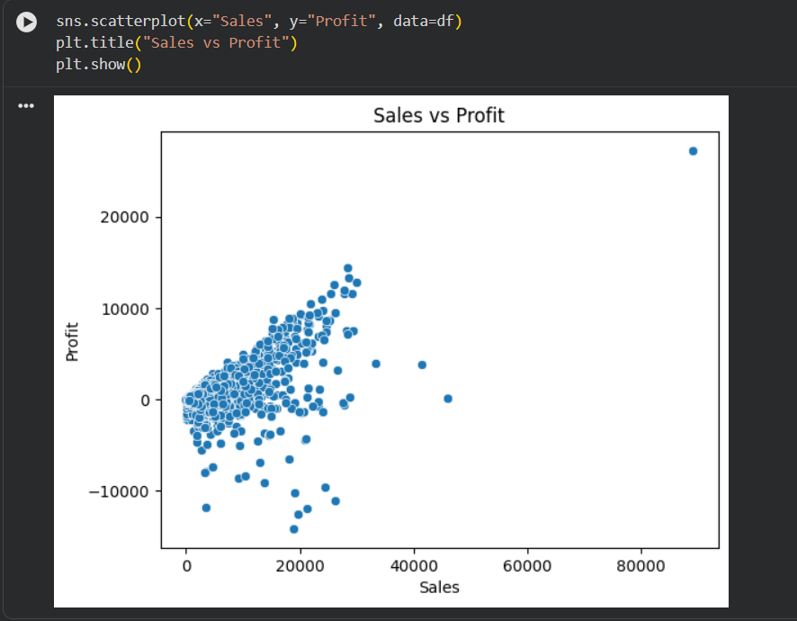
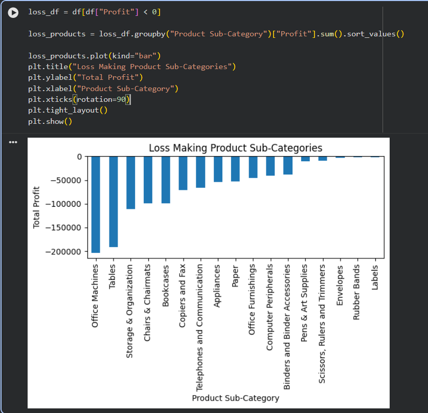

# 📊 Superstore Sales Analysis

## 📌 Objective
Analyze sales data to identify profitability issues, customer trends, and regional performance.

## 🛠 Tools Used
- Python (Pandas, Matplotlib, Seaborn)
- Google Colab

## 📈 Key Insights
- High sales do not guarantee profit due to excessive discounting.
- Furniture category shows consistent losses.
- Technology category has the highest profit margin.
- Certain regions underperform despite strong sales.
- A small group of customers contributes significantly to revenue.

## 💡 Business Recommendations
- Reduce discounts in loss-making products.
- Focus on high-margin categories.
- Improve pricing strategy in low-profit regions.
- Retain top customers with loyalty programs.

## 📂 Dataset
Superstore dataset used for analysis.

## 🚀 Project Type
End-to-end Exploratory Data Analysis (EDA)

## Key Visualizations & Insights
1️⃣ Sales vs Profit

2️⃣ Loss-Making Sub-Categories

